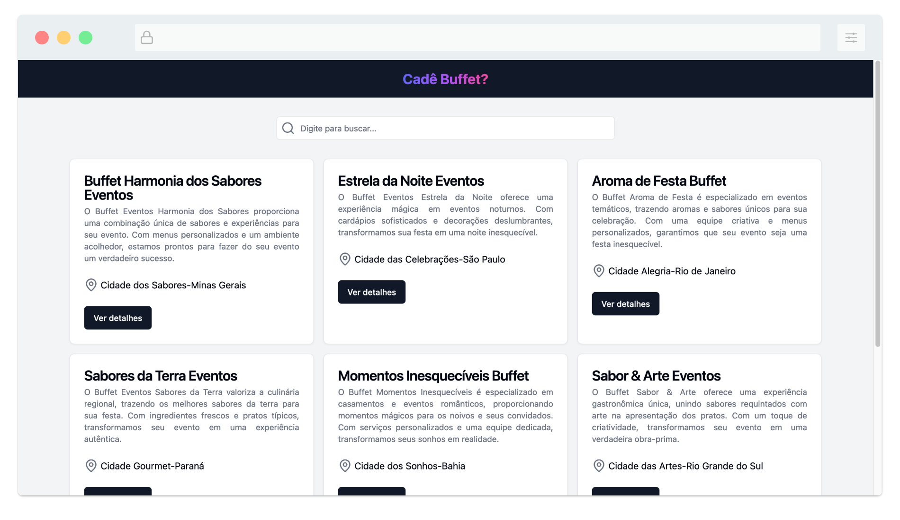
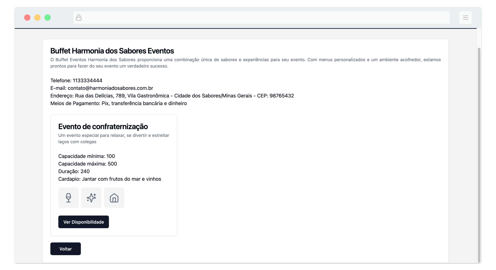
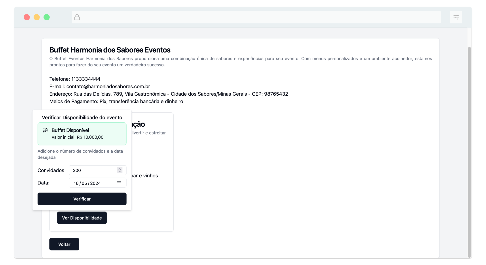

# Sobre
Versão minima da aplicação Cadê Buffet, utilizando VueJS no front-end e consumindo a API em Ruby on Rails.

---
# Visualização




----
# Tecnologias usadas
[Vue](https://vuejs.org/)
[Vite](https://vitejs.dev/)
[Shadcn-Vue](https://www.shadcn-vue.com/)
[TailwindCSS](https://tailwindcss.com/)
[Lucide-Vue](https://lucide.dev/)

# Instalando e usando
  - Clone esse projeto e o projeto em Rails
  ```bash
  git clone https://github.com/delania-oliveira/cade-buffet-frontend.git
  git clone https://github.com/delania-oliveira/cade-buffet.git
  ```
  - Abra o diretório do projeto em rails e rode os seguintes comandos
  ```bash
    cd cade-buffet
    bundle install
    bundle exec rake assets:precompile
    rails db:migrate db:seed
    rails server
  ```
  O servidor deve estar rodando no `http://localhost:3000/`
  > ruby v: 3.2.2
  > rails v: 7.0.8.1

  - Abra o diretorio do front-end em  Vue, instale as dependencias e rode a aplicação
  ```bash
    cd cade-buffet-frontend
    npm install
    npm run dev
  ```
  A aplicação deve estar rodando no `http://localhost:5173/`
  
